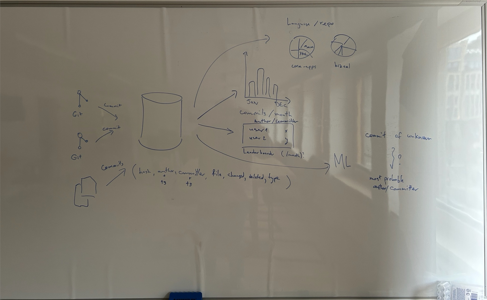

# Short and sweet

## Intro to Apache Spark

---

# Intro, reason & background

* ETL
* Divide-and-conquer
* Map-reduce

---

# Brief history of Apache Spark

* (Google) GFS, MapReduce, Bigtable
* (Yahoo) -> (Apache) Hadoop
* (Apache) Apache Hive, Apache Storm, Apache Impala, Apache Giraph, Apache Drill, Apache Mahout, ...
* (AMPLab) -> (Apache) Spark -> Databricks [1]

[1]: Learning Spark, 2nd edition, Chapter 1

---

# Brief setup of Apache Spark

* Spark application, driver, session, cluster manager, executor
* Spark driver, job, stage, task [2]

[2]: Learning Spark, 2nd edition, Chapter 2

---

# Brief Apache Spark vs Databricks

https://www.databricks.com/spark/comparing-databricks-to-apache-spark

---

# Brief API overview
* RDD vs DataFrame and Dataset (Structured untyped and typed API)
* Rows vs Columns
* Mutable vs Immutable
* Transformations vs Actions (Table 2-1) [3]
* Narrow vs Wide
* Joins (**BroadcastHashJoin**, ShuffleHashJoin, **ShuffleSortMergeJoin**, BroadcastNestedLoopJoin, ShuffleAndReplicatedNestedLoopJoin)

[3]: Learning Spark, 2nd edition, Chapter 2

<!-- Pandas! -->

---

# Demo

---

# Links
* https://spark.apache.org/
* https://github.com/databricks/LearningSparkV2
* https://www.databricks.com/learn/free-edition
* https://www.youtube.com/playlist?list=PL19TxVqoJEnTKIFFfdWYRrbSAyI6jENot
* https://speakerdeck.com/sorooshkhodami/wearedevelopers-berlin-2024-why-and-when-should-we-consider-stream-processing-in-our-solutions

---

# Q&A
